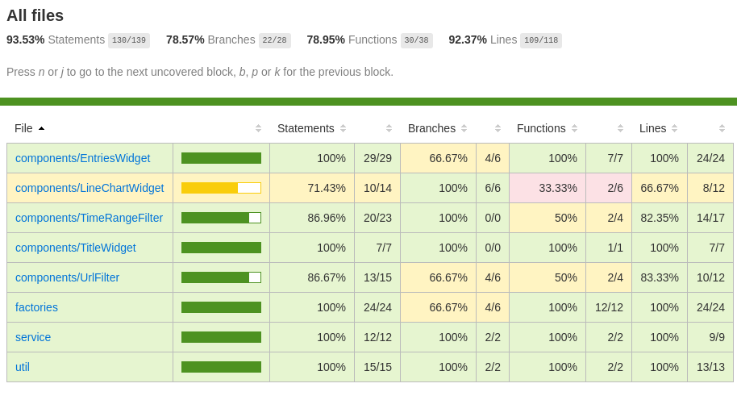

# PerfAnalytics Dashboard

PerfAnalytics **Dashboard** is part of PerfAnalytics ecosystem which collects and criticizes web performance data. 

PerfAnalytics **Dashboard** shows metrics that comes from [**PerfAnalytics API**](https://github.com/hasantezcan/PerfAnalytics-api)


## Demo Sites for Metric Data

You can create analytics metric data from those sites:

- **`Test site 1:`** https://react-metrics.netlify.app/
- **`Test site 2:`** https://penguins-metrics.netlify.app/
- **`Test site 3:`** https://random-metrics.netlify.app/
## Tech Stack
- Developed with [React Typescript](https://www.typescriptlang.org/docs/handbook/react.html)
- Used [Ant design](https://ant.design/) as a UI library.
- Used [Recharts](https://recharts.org/en-US/) for metric charts
- Used [React Testing Library](https://testing-library.com/docs/react-testing-library/intro/) and [Jest](https://jestjs.io/) for testing
- Deployed with [GitHub pages](https://pages.github.com/).
- Used [GitHub Actions](https://github.com/actions) for CI/CD   

## Code coverage



## For Development

Install packages.
```bash
  yarn install
```

- Runs the app in the development mode.

```bash
  yarn start
```
Open [http://localhost:3000](http://localhost:3000) to view it in the browser.

> **And also you can run tests like that:**

```bash
  yarn test
```

## For Deploy with GitHub pages

- You need to add this enviroment variable as a [GitHub secret key.](https://docs.github.com/en/actions/reference/encrypted-secrets). 

```bash
SKIP_PREFLIGHT_CHECK=true
```

> **This prevent croco warning!**

Set **gh-pages** branch as the main GitHub pages branch from repo GitHub pages settings.

After that GitHub action will work and the site will deploy under:

```bash
https://<username>.github.io/<repoName>/
```

> Click for detail github pages deployment tutorial is [here!](https://codeburst.io/deploying-a-react-app-using-github-pages-and-github-actions-7fc14d380796)
## Dev Logs

You can reach my [**`dev logs`**](DEVLOGS.md) about this project! 

## Commit message convention

I use [this](https://www.conventionalcommits.org) commit message conventions standard in this project.
> https://www.conventionalcommits.org

 
## License

[MIT](/LICENSE)